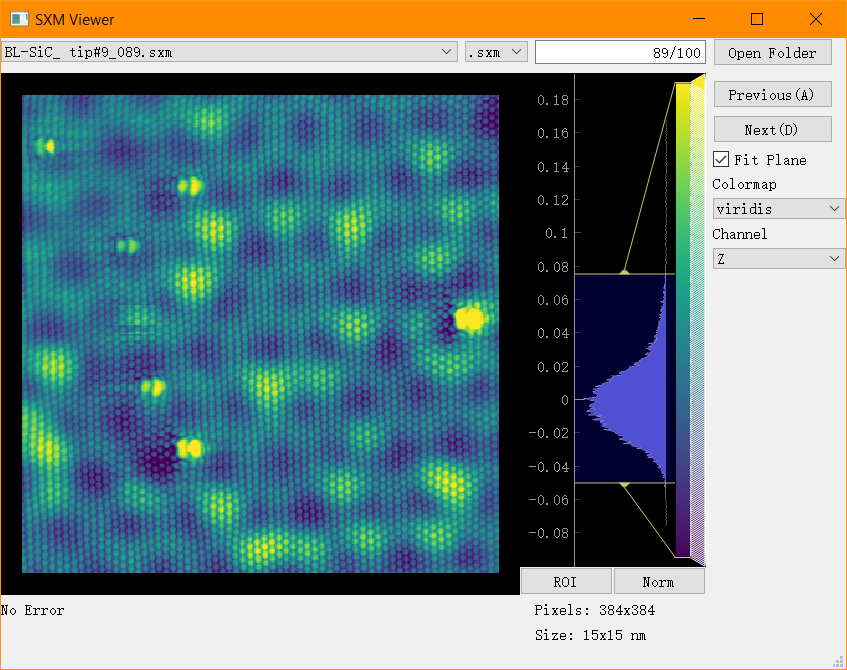

## SXM data visualization tool
-----------------

This data visualization tool is a GUI app for Nanonis `.sxm` file. It is compatible with Python 3.6+. The GUI is based on PyQt5 and PyQtGraph.

Compare to the native LabView app from Nanonis, this tool is a lot faster and can be used in varies OS due to the cross-platform feature of PyQt.

### Functionality

- Load and visualize data from `.sxm` and `.npy` file.
    - So far it only supports the 'Z' channel.
- Subtract a 2D fitted plane from the original image.
- The default setup includes more than 60 colormaps from matplotlib.
- Adjust color range, export image and raw data by right-clicking on the image.

### Run app

To start application, run:

    python3 app.py

### Dependencies

Make sure that you have installed the dependencies.

    pip install -r requirements.txt

### Screenshot

